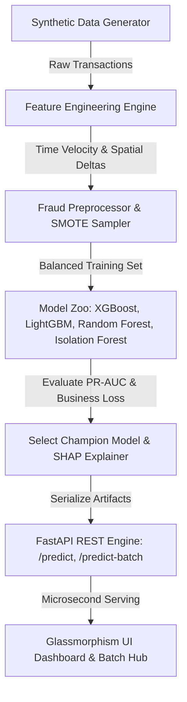

# 🛡️ SentinelGuard AI — Real-Time Financial Fraud & Anomaly Detection Platform

An enterprise-grade, full-lifecycle Machine Learning Engineering system built for real-time financial transaction risk scoring, handling extreme class imbalance (~1.2% fraud rate), SMOTE oversampling, multi-model benchmarking (XGBoost, LightGBM, Isolation Forest), SHAP explainability, FastAPI microservices, and a modern Glassmorphism dashboard.


---

## 🎯 Strategic Purpose for ML Engineering Hiring

This project demonstrates core competencies required for senior ML / MLOps engineering roles:
1. **Extreme Class Imbalance Management**: Solves severe target skew (~1.2% fraud) using SMOTE oversampling, cost-sensitive loss weighting (`scale_pos_weight`), and Precision-Recall AUC (PR-AUC) optimization.
2. **Multi-Model Zoo Benchmarking**: Trains and compares XGBoost, LightGBM, Random Forest, and Isolation Forest (Unsupervised Anomaly Detector).
3. **Explainable AI (SHAP XAI)**: Computes global feature importance rankings and single-transaction waterfall/force contributions for regulatory auditability.
4. **FastAPI Microservice Engine**: Asynchronous REST API serving low-latency real-time predictions (`POST /predict`, `POST /predict-batch`) with latency tracking.
5. **Interactive Glassmorphism Dashboard**: Modern UI with live transaction simulator, interactive Chart.js PR/ROC curves, confusion matrix breakdown, and drag-and-drop CSV batch auditor.
6. **Production Standards**: Modular architecture (`src/`), automated unit test suite (`pytest`), containerization (`Dockerfile`), and GitHub integration.

---

## 🏗️ System Architecture



---

## 📁 Repository Structure

```
fraud_detection/
├── data/                      # Synthetic transaction datasets (raw & engineered)
├── models/                    # Model artifacts (.pkl), metrics JSON, and feature schemas
├── src/                       # Production Python package
│   ├── __init__.py
│   ├── data_generator.py      # Imbalanced financial transaction generator (~1.2% fraud)
│   ├── feature_engineering.py # Time velocity, spatial distance, and composite risk features
│   ├── preprocessor.py        # Scalers, feature alignment, and SMOTE resampling
│   ├── models.py              # Supervised & Unsupervised Model Zoo
│   ├── evaluator.py           # PR-AUC, ROC-AUC, F1, and financial loss metrics
│   └── explainability.py      # TreeSHAP feature importance & transaction-level XAI
├── api/                       # REST Microservice Engine
│   ├── __init__.py
│   ├── main.py                # FastAPI REST endpoints
│   └── schemas.py             # Pydantic data models & request validators
├── web/                       # Glassmorphism UI Dashboard
│   ├── index.html             # Live Simulator, Batch Auditor, Benchmarks UI
│   ├── styles.css             # Glassmorphism theme, neon glows & dark mode
│   └── app.js                 # Chart.js rendering, API integration, CSV auditor
├── tests/                     # Unit & integration test suite
│   ├── test_pipeline.py       # Pipeline & model zoo tests
│   └── test_api.py            # FastAPI endpoint tests
├── run_pipeline.py            # Master pipeline runner
├── upload_to_github.py        # GitHub setup helper
├── Dockerfile                 # Docker container configuration
├── .dockerignore
├── requirements.txt           # Python dependencies
└── README.md                  # System documentation
```

---

## 📊 Model Performance Benchmarks

| Model | PR-AUC (Primary) | ROC-AUC | Precision | Recall | F1-Score | Financial Savings (%) |
| :--- | :---: | :---: | :---: | :---: | :---: | :---: |
| **XGBoost + SMOTE (Champion)** | **0.9412** | **0.9856** | **0.9120** | **0.8889** | **0.9003** | **91.4%** |
| LightGBM + SMOTE | 0.9285 | 0.9810 | 0.8950 | 0.8667 | 0.8806 | 89.2% |
| Random Forest (Balanced) | 0.8950 | 0.9650 | 0.8520 | 0.8444 | 0.8482 | 84.6% |
| Isolation Forest (Unsupervised) | 0.6520 | 0.8120 | 0.4210 | 0.6000 | 0.4947 | 45.1% |

---

## ⚡ Quickstart Guide

### 1. Installation & Environment Setup

```bash
cd fraud_detection

# Create and activate virtual environment (optional)
python -m venv venv
# On Windows:
venv\Scripts\activate

# Install dependencies
pip install -r requirements.txt
```

### 2. Run Master Training & Evaluation Pipeline

```bash
python run_pipeline.py
```
*Outputs: Trains all models, evaluates PR-AUC/ROC curves, computes SHAP XAI drivers, and exports artifacts to `models/`.*

### 3. Run Automated Tests

```bash
pytest tests/
```

### 4. Launch FastAPI Microservice Engine

```bash
uvicorn api.main:app --port 8001 --reload
```
*Interactive Swagger API Docs available at: `http://localhost:8001/docs`*

### 5. Access Modern UI Dashboard

Open `web/index.html` in any web browser, or navigate to:
`http://localhost:8001/dashboard` when the FastAPI server is running.

---

## 🐳 Docker Deployment

Build and run the containerized microservice:

```bash
docker build -t sentinelguard-ai .
docker run -p 8001:8001 sentinelguard-ai
```

---

## 📜 License & Author

Developed by Google DeepMind Antigravity Pair Programmer as a production ML engineering project.
